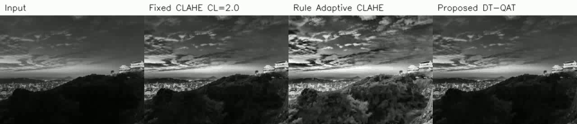
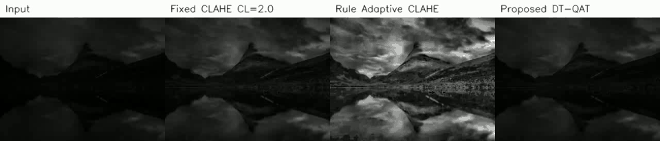
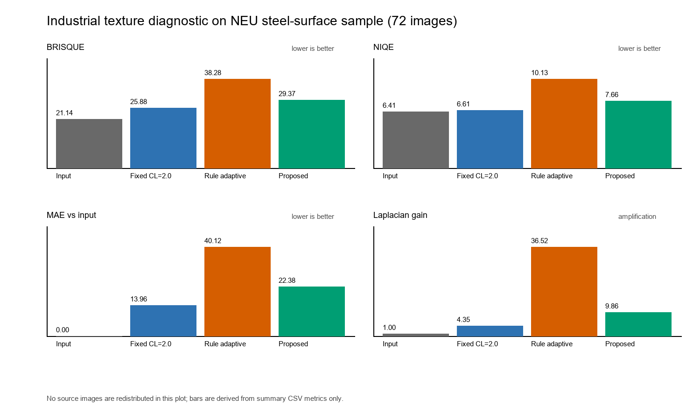

# RL-CLAHE FPGA Artifact

Public source-available engineering artifact for the paper:

> Stall-Free Software--Hardware Co-Design for Perception-Driven CLAHE

This repository collects the reproducibility materials used during the TECS
major-revision response: evaluation scripts, summary CSV files, fixed-point
export utilities, RTL snippets, and diagnostic visual evidence.

## Important Boundary

This repository does **not** include paper files:

- no manuscript `.tex` sources,
- no submitted or revised paper PDFs,
- no response-letter PDFs,
- no reviewer reports or confidential review material.

It also does not redistribute full training datasets, large source videos,
industrial source images, Vivado run caches, bitstreams, or private lab paths.

## License And Attribution

The code and derived materials are released as a public, source-available
research artifact under the repository `LICENSE`.

In short:

- You may inspect and run the materials for academic, non-commercial research
  evaluation and reproducibility.
- You must preserve copyright, license, and citation metadata.
- You may not present this artifact, its results, or derivative work as your own
  original unpublished work.
- Commercial use, sublicensing, and unattributed redistribution are not
  permitted without written permission from the authors.

See `CITATION.cff` for the citation metadata. If you use any part of this
artifact in a publication, thesis, report, or derived implementation, cite the
associated paper and this repository.

## Repository Contents

Included:

- `software/`: evaluation, ablation, distillation-check, and fixed-point export
  scripts.
- `rtl/`: representative SystemVerilog modules for the fixed-point adaptive
  controller and supporting preprocessing blocks.
- `scripts/`: small helper scripts used for reproducibility checks.
- `results/metrics/`: CSV summaries for test-set metrics and tail robustness.
- `results/ablation/`: student and quantization ablation summaries.
- `results/hardware_reports/`: Vivado report snapshots used as tool-estimate
  evidence.
- `results/video_diagnostics/`: derived 5-second four-way comparison videos and
  GIF previews for the two real-video diagnostic clips.
- `results/industrial_texture_diagnostic/`: derived industrial-texture metrics
  and a metric-only plot for high-texture/noise discussion.
- `docs/`: reproducibility notes and hardware-validation notes.

Not included:

- full training datasets,
- raw YouTube video files,
- raw NEU/MVTec/industrial dataset images,
- model checkpoints that require separate license/path review,
- board bitstreams and private lab captures,
- manuscript or response-letter files.

## Quick Start

The stable software entry points are:

```bash
python software/experiment/run_ablation_on_testset_V4.py
python software/distillation/verify_student_5step_hw_like.py
python software/distillation/export_student_q12_multihead_V2.py
```

Some scripts require local datasets or checkpoints that are not bundled. See
`docs/reproducibility_plan.md` for the remaining setup checklist.

## Evidence Overview

### Fixed-Clip And Tail Robustness

`results/metrics/` contains CSV files used to reproduce the test-set mean and
tail-robustness summaries. These files support the interpretation that the main
benefit is deployable adaptive control and reduced tail risk, rather than
claiming a large mean-quality win on every scene.

### Video Diagnostic Supplement

`results/video_diagnostics/` contains compact, derived comparison videos and
GIF previews for the two real-video diagnostic clips used for supplemental
validation. Each panel is arranged as Input / Fixed CLAHE CL=2.0 / Rule
Adaptive CLAHE / Proposed DT-QAT.

#### Japan Lighting Change



- `japan_lighting_4way_30f_5s.mp4`: Input / Fixed CLAHE CL=2.0 / Rule Adaptive
  CLAHE / Proposed DT-QAT, 30 frames rendered as a 5-second comparison video.
  Local source video used during revision:
  `https://www.youtube.com/watch?v=G5RpJwCJDqc`.

#### Norway Fade-In



- `norway_fadein_4way_30f_5s.mp4`: the same four-column comparison for the
  Norway fade-in clip, 30 frames rendered as a 5-second comparison video.
  Local source video used during revision:
  `https://www.youtube.com/watch?v=Scxs7L0vhZ4`.

The original large video files are not redistributed. The MP4 files are derived
diagnostic panels for reviewer inspection, not a claim of board-level
hardware-in-the-loop evaluation.

### Industrial Texture Diagnostic

`results/industrial_texture_diagnostic/` contains metric-only derived evidence
for high-texture industrial scenes. The local diagnostic used a 72-image sample
from six NEU steel-surface defect classes, but the source images are not
redistributed here.

The diagnostic should be read as limitation evidence:

- aggressive rule-based adaptive CLAHE strongly amplifies high-frequency
  texture/noise;
- the proposed controller is more moderate than the rule-based adaptive
  baseline;
- fixed CLAHE with CL=2.0 remains more conservative on this particular
  industrial sample;
- therefore highly textured or noisy industrial surfaces are a boundary case
  for the current clip-limit-only controller.



## Mapping To Review Comments

- R1-2: fixed CLAHE sensitivity, scene-wise behavior, video diagnostics, and
  tail robustness.
- R1-3 / R2-2: hardware resource, latency, power, and energy tool estimates.
- R3-6 / R3-8: FPGA resource comparison and RTL/software consistency checks.
- R3-10: high-texture industrial-scene limitation evidence.
- R3-11: code/artifact availability.

## Engineering Status

This artifact is not a polished product SDK. It is a cleaned research artifact
intended to make the revision evidence auditable. Paths, datasets, and Vivado
project files may need local adaptation before a full rerun.
